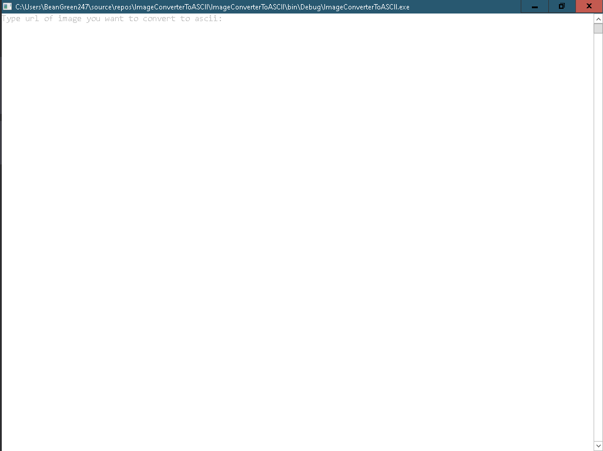

## Image to ASCII Converter
# Usage
How to use this app?
Simple get the link to the image you want to convert to ASCII.
Copy that link.
Open the app and insert that likn you copied when prompted for it.
Hit enter and viola!

# Example
Lets say I want to convert a meme.
https://cdn.netzpolitik.org/wp-upload/one-does-not-meme.jpg

Like this one.

I recomment to pick the white color scheme like shown, for better results.

Step one open. You are asked to enter the link to the image.

